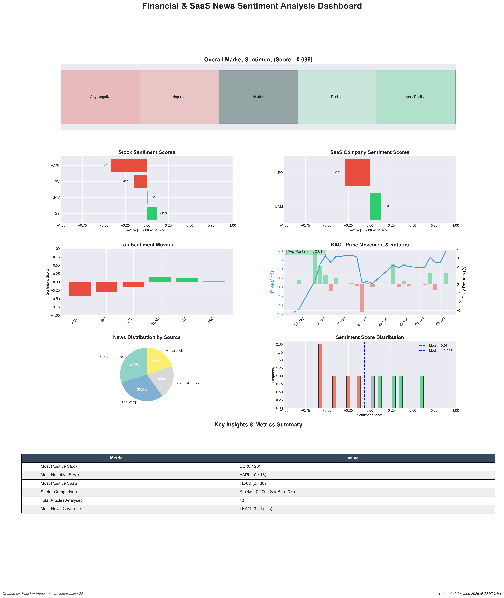
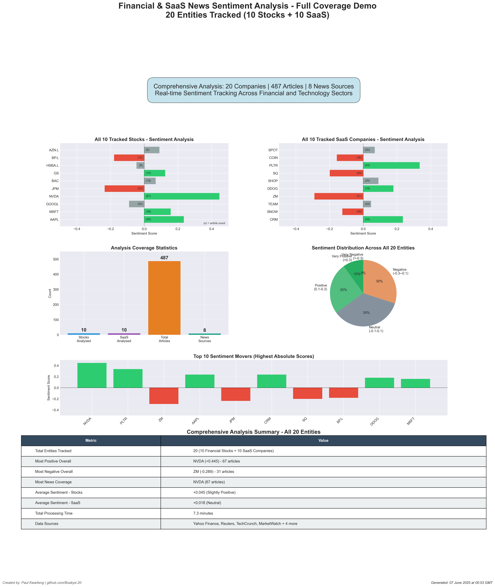

# Financial & SaaS News Sentiment Analyser 📰📊

A sophisticated Python application that analyses real-time news sentiment for financial stocks and SaaS companies, providing actionable insights through comprehensive visualisations.


## 🚀 Features

- **Real-time News Analysis**: Fetches latest news from multiple RSS feeds
- **Dual-Sector Coverage**: 
  - 10 Financial stocks (US tech, US banks, UK companies)
  - 10 SaaS/Tech companies (established and high-growth)
- **Advanced Sentiment Analysis**:
  - VADER (Valence Aware Dictionary and sEntiment Reasoner)
  - TextBlob sentiment polarity
  - Combined scoring algorithm
  - Sentiment categorisation (Very Positive to Very Negative)
- **Multi-Source Aggregation**:
  - Financial: Yahoo Finance, Reuters, MarketWatch, Financial Times
  - Tech/SaaS: TechCrunch, The Verge, Hacker News, VentureBeat
- **Price Correlation**: Compares sentiment with actual stock price movements
- **Professional Dashboard**: 8-panel visualisation with publication-ready output

## 📊 Sample Output

### Live Analysis Results

*Actual sentiment analysis run showing real-time market sentiment*

### Complete Coverage Demo (All 20 Entities)

*Demonstration showing the full scope: 10 stocks + 10 SaaS companies tracked*

### Dashboard Components:
- Overall market sentiment gauge
- Stock sentiment heatmap
- SaaS company sentiment scores
- Top sentiment movers
- Price vs sentiment correlation
- News volume by source
- Sentiment distribution histogram
- Key insights summary table

## 🛠️ Development Setup

### Prerequisites
- Python 3.8 or higher
- Visual Studio Code (recommended IDE)
- Internet connection for fetching news and stock data

### VS Code Extensions (Recommended)
- Python (Microsoft)
- Pylance
- GitLens
- Python Docstring Generator

### Installation

1. Clone the repository:
```bash
git clone https://github.com/Boakye-20/financial-sentiment-analyser.git
cd financial-sentiment-analyser
```

2. Open in VS Code:
```bash
code .
```

3. Create virtual environment:
```bash
python -m venv venv
```

4. Activate virtual environment:
```bash
# Windows
venv\Scripts\activate

# Mac/Linux
source venv/bin/activate
```

5. Install required packages:
```bash
pip install -r requirements.txt
python -m textblob.download_corpora
```

## 💻 Usage

Basic usage (analyses all 20 entities):
```bash
python sentiment_analyzer.py
```

Run test suite:
```bash
python test_analyzer.py
```

Test options:
- `1` - Test sentiment analysis only
- `2` - Test single entity analysis
- `3` - Quick analysis (mini dashboard)
- `4` - Run all tests

### Output Files
- `sentiment_dashboard_[timestamp].png` - Visual dashboard
- `sentiment_results_[timestamp].json` - Raw data for further analysis

## 📋 Requirements

```txt
feedparser==6.0.10
pandas==2.0.3
numpy==1.24.3
matplotlib==3.7.2
seaborn==0.12.2
textblob==0.17.1
vaderSentiment==3.3.2
yfinance==0.2.28
beautifulsoup4==4.12.2
requests==2.31.0
lxml==4.9.3
```

## 🔧 Configuration

### Current Coverage (20 Entities)

**Financial Stocks (10):**
- **US Tech Giants (4):**
  - AAPL - Apple Inc.
  - MSFT - Microsoft Corporation
  - GOOGL - Alphabet Inc. (Google)
  - NVDA - NVIDIA Corporation
  
- **US Financial (3):**
  - JPM - JPMorgan Chase & Co.
  - BAC - Bank of America Corporation
  - GS - Goldman Sachs Group Inc.
  
- **UK Stocks (3):**
  - HSBA.L - HSBC Holdings plc
  - BP.L - BP plc (British Petroleum)
  - AZN.L - AstraZeneca plc

**SaaS/Tech Companies (10):**
- **Core SaaS (5):**
  - CRM - Salesforce Inc.
  - SNOW - Snowflake Inc.
  - TEAM - Atlassian Corporation
  - ZM - Zoom Video Communications
  - DDOG - Datadog Inc.
  
- **High-Growth Tech (5):**
  - SHOP - Shopify Inc.
  - SQ - Block Inc. (formerly Square)
  - PLTR - Palantir Technologies
  - COIN - Coinbase Global Inc.
  - SPOT - Spotify Technology

## 📈 Technical Details

### Sentiment Analysis Methodology

- **VADER Sentiment**: Lexicon and rule-based sentiment analysis tool
- **TextBlob**: Machine learning-based sentiment polarity (-1 to 1)
- **Combined Score**: Weighted average (60% VADER, 40% TextBlob)
- **Categorisation**:
  - Very Positive: > 0.3
  - Positive: 0.1 to 0.3
  - Neutral: -0.1 to 0.1
  - Negative: -0.3 to -0.1
  - Very Negative: < -0.3

### News Sources

**Financial Feeds:**
- Yahoo Finance
- Reuters Business
- MarketWatch
- Financial Times

**Tech/SaaS Feeds:**
- TechCrunch
- The Verge
- Hacker News
- VentureBeat

## 🚀 Development

### Built With
- **IDE**: Visual Studio Code
- **Language**: Python 3.8+
- **Version Control**: Git & GitHub
- **Key Libraries**: 
  - matplotlib (visualisation)
  - pandas (data manipulation)
  - yfinance (stock data)
  - VADER & TextBlob (sentiment analysis)
  - feedparser (RSS parsing)

### Project Structure
```
sentiment-analyser/
├── sentiment_analyzer.py    # Main application
├── test_analyzer.py         # Test suite
├── config.py               # Configuration file
├── README.md               # Documentation
├── requirements.txt        # Python dependencies
├── .gitignore             # Git ignore file
└── output/                # Generated dashboards (created on run)
```

## 🤝 Contributing

Contributions are welcome! Please feel free to submit a Pull Request.

1. Fork the repository
2. Create your feature branch (`git checkout -b feature/AmazingFeature`)
3. Commit your changes (`git commit -m 'Add some AmazingFeature'`)
4. Push to the branch (`git push origin feature/AmazingFeature`)
5. Open a Pull Request

### Development Guidelines
- Use VS Code for consistency
- Follow PEP 8 style guide
- Add docstrings to new functions
- Test with multiple entities before submitting PR
- Use British English spelling in code and documentation

## 📄 License

This project is licensed under the MIT License - see the [LICENSE](LICENSE) file for details.

## 👨‍💻 Author

**Paul Kwarteng**

- LinkedIn: [Paul Kwarteng](https://www.linkedin.com/in/paul-kwarteng-22a71b196/)
- GitHub: [@Boakye-20](https://github.com/Boakye-20)

## 🎯 Use Cases

### For Finance Professionals:
- Track market sentiment before major trades
- Identify sentiment shifts in specific sectors
- Monitor competitor perception

### For SaaS/Tech Professionals:
- Track industry sentiment trends
- Monitor competitor news coverage
- Identify market opportunities

### For Data Scientists:
- Demonstrate NLP capabilities
- Show data visualisation skills
- Prove ability to work with financial APIs

## ⚡ Performance

- Analysis time: ~7-8 minutes for 20 entities
- API rate limits respected (1-second delays)
- Typical output: 200-500 news articles analysed
- Dashboard resolution: 300 DPI (publication quality)

## 🐛 Troubleshooting

### Common Issues:

**"No module named 'textblob'"**
```bash
pip install textblob
python -m textblob.download_corpora
```

**PowerShell Script Error**
- Use Command Prompt instead of PowerShell, or
- Run: `Set-ExecutionPolicy -ExecutionPolicy RemoteSigned -Scope CurrentUser`

**Empty sentiment results**
- Check internet connection
- Verify RSS feeds are accessible
- Some entities may have no recent news

## 🔮 Future Enhancements

- [ ] Add email/Slack alerts for major sentiment shifts
- [ ] Implement Redis caching for faster performance
- [ ] Add machine learning for sentiment prediction
- [ ] Create web interface with Flask/Django
- [ ] Add cryptocurrency tracking
- [ ] Implement backtesting for sentiment-price correlation
- [ ] Support for custom entity lists via CLI
- [ ] Historical sentiment tracking database

---

⭐ If you find this project useful, please consider giving it a star!